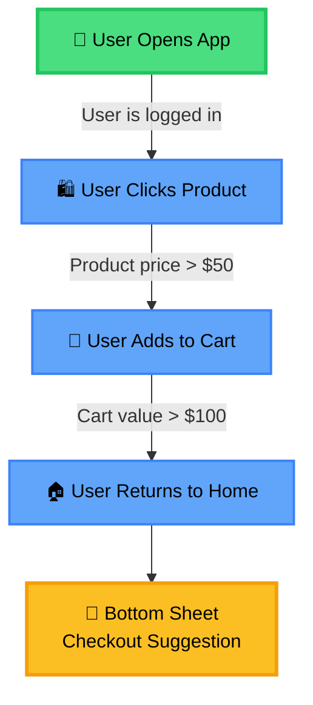
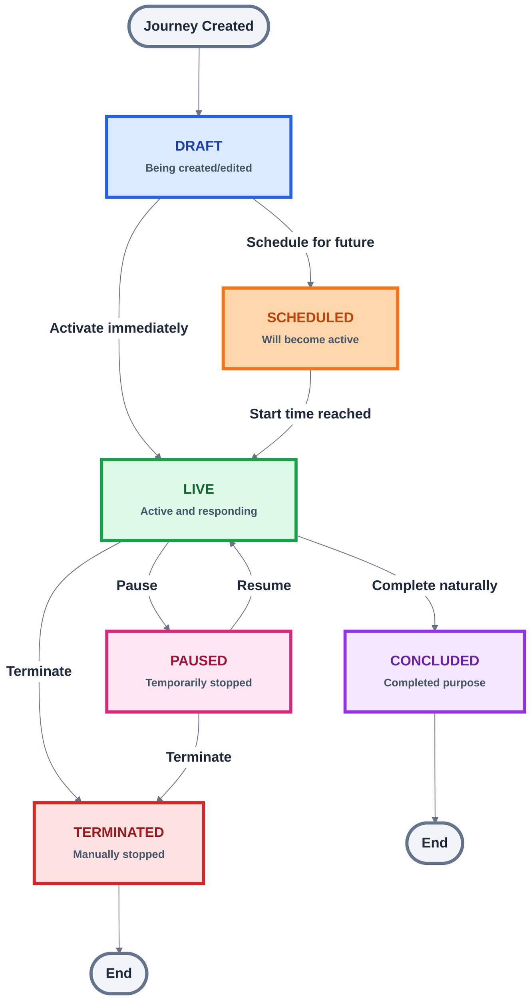

# Journeys Overview

## What is a Journey?

A **journey** is a visual flow that maps user behavior through a series of steps (nodes) connected by transitions. Each journey represents a user's path through your application, from entry points to specific events, with optional rules and conditions that determine progression, ultimately leading to engagement moments where users receive targeted messages.

## Example Journey

Here's an example of an E-Commerce Shopping Journey:

**Let's follow a user through this journey:**

Imagine Sarah is shopping on your app:

1. **Sarah opens the app** → The journey starts tracking her
2. **Is Sarah logged in?** → Yes! She moves to the next step
3. **Sarah clicks on a product** → The product costs $75 (over $50), so she moves forward
4. **Sarah adds it to her cart** → Her cart total is now $120 (over $100), so she continues
5. **Sarah goes back to the home page** → A Bottom Sheet pops up suggesting she checkout

**What happens behind the scenes:**
- When Sarah opens the app, the journey starts
- The journey waits for her to click a product (and checks if she's logged in)
- Once she clicks a product, the journey waits for her to add it to cart (and checks the price)
- Once she adds to cart, the journey waits for her to return home (and checks the cart value)
- When she returns home, the Bottom Sheet appears

Think of it like a path: Sarah walks along it, and at each step, the journey checks if she meets the conditions before letting her continue.

:::note Important
All user actions in this example (opening the app, clicking a product, adding to cart, returning home) must have corresponding events associated with them in your application.
:::

## Journey Lifecycle

Journeys have different statuses that change as you manage them. The following diagram shows all possible state transitions for a Journey:

### Status Definitions

| Status | Description | Available Actions |
|:-------|:------------|:------------------|
| **Draft** | Journey is being created or edited, not visible to users | Edit, Clone, Make Live, Schedule, Terminate |
| **Live** | Journey is published and actively reaching users | Pause, Conclude, Terminate |
| **Scheduled** | Journey is set to go live at a future date/time | Edit, Terminate |
| **Paused** | Journey is temporarily stopped, can be resumed | Edit, Make Live, Terminate |
| **Concluded** | Journey has completed its run as intended | Clone |
| **Terminated** | Journey is permanently stopped | Clone |

## Next Steps

- **[Creating a Journey](./creating-journey)** - Step-by-step guide to build your first journey
- **[Transitions & Conditions](./transitions-rules)** - Connect nodes with transitions and conditions
- **[Engagements](./engagements)** - Learn about engagement types and how to add them

