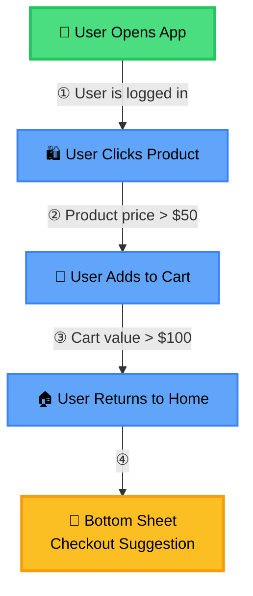

# Transitions & Rules

Transitions connect nodes in your journey, defining how users move from one step to another. Rules (also called conditions) add logic to transitions, controlling which users progress based on specific criteria.

## How Transitions Work

**Critical Concept:** A transition from Node A (with event "ABC") to Node B happens when event "ABC" is triggered in your app, **NOT** when Node B's event is triggered.

Once users reach Node B, the next transition will occur when Node B's event happens.

<div style={{ textAlign: 'center', margin: '2rem 0' }}>



</div>

**How Each Transition Works:**

1. **Transition ①:** When the **"User Opens App"** event occurs (and the rule "User is logged in" passes), users move to the "User Clicks Product" node.

2. **Transition ②:** When the **"User Clicks Product"** event occurs (and the rule "Product price > $50" passes), users move to the "User Adds to Cart" node.

3. **Transition ③:** When the **"User Adds to Cart"** event occurs (and the rule "Cart value > $100" passes), users move to the "User Returns to Home" node.

4. **Engagement ④:** When the **"User Returns to Home"** event occurs, the "Bottom Sheet" engagement is shown to users.

### Rules

**All Rules Must Pass**

If you add multiple rules to a transition, **ALL of them must be true** for the transition to happen.

**Example:**

```
Transition: Node A → Node B
Rules:
  - "User is logged in" = true
  - "Product price" > 50
  - "Cart value" > 100
```

**Result:** The transition only occurs if the user is logged in **AND** product price > $50 **AND** cart value > $100. If any rule fails, the user stays at Node A.

**No Rules:** If you don't add any rules, **everyone moves to the next node** when the current node's event occurs.

---

## Setting Up a Transition

To add a transition:

1. Click on the node you want to transition **from**
2. Find the **"Transitions"** section in the configuration panel
3. Click **"Add Transition"**
4. Select the target node or choose **"Exit"** to end the journey
5. Optionally click **"Add Rule"** to add conditions:
   - Select the property to check
   - Choose the operator
   - Set the value to compare against
6. Click **"Save"** on the node

The transition appears as an arrow in the canvas, with rules shown as labels.

See **[Creating a Journey](./creating-journey)** for detailed step-by-step instructions.

---

## Rule Operators

Operators available in the panel:

| Operator | Description | Example |
|:---------|:------------|:--------|
| `=` | Equals | `user.status` equals "premium" |
| `≠` | Not equal to | `user.status` not equal to "free" |
| `>` | Greater than | `product.price` greater than 50 |
| `<` | Less than | `cart.value` less than 100 |
| `≥` | Greater than or equal | `user.age` greater than or equal 18 |
| `≤` | Less than or equal | `item.count` less than or equal 5 |
| `In` | Value in list | `user.country` in ["US", "CA", "UK"] |
| `Not In` | Value not in list | `user.plan` not in ["free", "trial"] |


